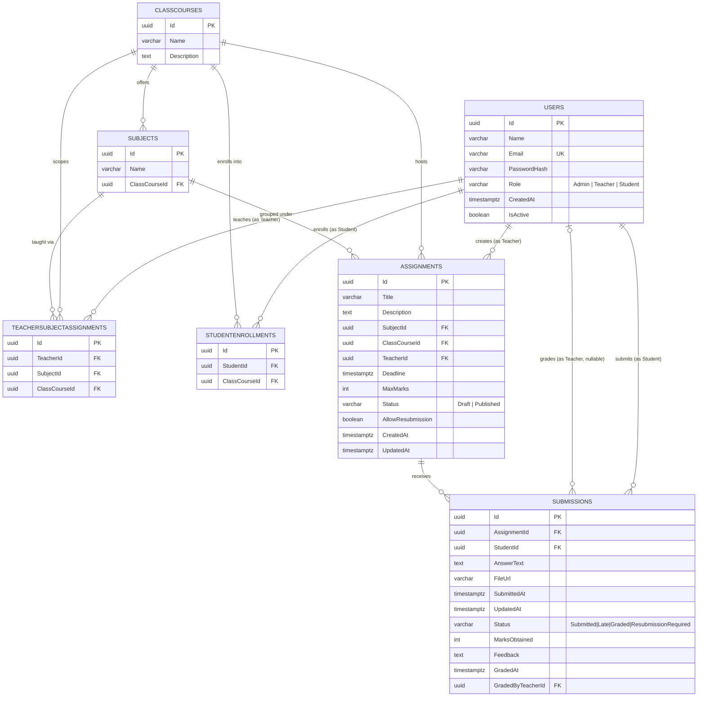

# Assignment & Submission Management System

A complete, production-quality, role-based **Assignment & Submission Management System** built with **ASP.NET Core (.NET 10)** following **Clean Architecture**, **CQRS with MediatR**, **Database-First EF Core** on **PostgreSQL**, and a modern **Next.js (App Router)** frontend with **TypeScript** & **Tailwind CSS**.

---

## 🌟 Features & Role Capabilities

### 👑 Admin
- **User Management**: Create, view, update, and deactivate Admin, Teacher, and Student accounts.
- **Academic Setup**: Create and manage Classes/Courses and Subjects.
- **Teacher Allocations**: Map teachers to specific subjects and classes/courses.
- **Student Enrollments**: Enroll students into classes/courses.
- **System Visibility**: Full read visibility into all system assignments and student submissions.

### 👩‍🏫 Teacher
- **Assignment Lifecycle**: Create, update, publish, or delete assignments for subjects/classes they are assigned to teach.
- **Draft & Publish Controls**: Keep assignments in `Draft` state (hidden from students) until ready, or publish immediately.
- **Submission Reviews**: View all student submissions for created assignments.
- **Grading & Feedback**: Assign marks obtained (`MarksObtained <= MaxMarks`) and provide constructive feedback to students.
- **Status Management**: Mark submission statuses (`Graded`, `ResubmissionRequired`, `Late`).

### 🎓 Student
- **Assignment Feed**: View published assignments assigned to their enrolled class/course.
- **Submission Portal**: Submit text solutions and/or file attachments for published assignments before deadlines.
- **Resubmission Support**: Update submissions before the deadline or when resubmissions are explicitly allowed.
- **Grades & Feedback**: Real-time view of marks obtained, teacher feedback, and submission status (`Submitted`, `Late`, `Graded`, `ResubmissionRequired`).

---

## 🛠️ Technology Stack

| Layer | Technology |
|---|---|
| **Frontend** | Next.js (App Router), React 19, TypeScript, Tailwind CSS, Lucide Icons, Typed API Client |
| **Backend API** | ASP.NET Core Web API (.NET 10), C#, RESTful endpoints |
| **Architecture** | Clean Architecture (Domain, Application, Infrastructure, Api, Tests) |
| **CQRS Pattern** | MediatR pipeline behaviors for FluentValidation and request logging |
| **ORM & Database** | PostgreSQL 18 + EF Core (Database-First mode via `schema.sql` and `seed.sql`) |
| **Security & Auth** | JWT Bearer Authentication, BCrypt Password Hashing (`BCrypt.Net-Next`) |
| **Testing** | xUnit, Moq, FluentAssertions |
| **API Documentation** | Swagger / OpenAPI UI with JWT Bearer security integration |

---

## 📁 Solution Architecture

The backend strictly follows **Clean Architecture** boundaries with dependencies flowing inward only:

```
AssignmentProject/
├── database/
│   ├── schema.sql              # PostgreSQL DDL script (tables, constraints, indexes)
│   └── seed.sql                # Seed data with demo accounts and assignments
│
├── backend/
│   ├── AssignmentSystem.Domain/        # Enterprise Domain layer: Entities, Enums, Exceptions
│   │   ├── Entities/           # User, ClassCourse, Subject, Assignment, Submission, etc.
│   │   ├── Enums/              # UserRole, AssignmentStatus, SubmissionStatus
│   │   └── Exceptions/         # DomainException, NotFoundException, ForbiddenException, etc.
│   │
│   ├── AssignmentSystem.Application/   # CQRS commands/queries (MediatR), DTOs, interfaces, validators
│   │   ├── Common/             # Interfaces (IRepository, IUnitOfWork), Behaviors (Validation, Logging)
│   │   ├── DTOs/               # Auth, User, Academic, Assignment, Submission DTOs
│   │   └── Features/           # CQRS feature handlers (Auth, Users, Academic, Assignments, Submissions)
│   │
│   ├── AssignmentSystem.Infrastructure/# EF Core DbContext, Repositories, JWT generator, PasswordHasher
│   │   ├── Persistence/        # AppDbContext, Repository implementations, UnitOfWork
│   │   ├── Authentication/     # JwtTokenGenerator, PasswordHasher (BCrypt)
│   │   └── Services/           # CurrentUserService (ClaimsPrincipal reader)
│   │
│   ├── AssignmentSystem.Api/           # Presentation layer: ASP.NET Core controllers, middleware, Swagger
│   │   ├── Controllers/        # Auth, Users, Academic, Assignments, Submissions controllers
│   │   ├── Middleware/         # ExceptionHandlingMiddleware (catches & wraps errors in ApiResponse<T>)
│   │   ├── Models/             # Standard ApiResponse<T> wrapper
│   │   └── Program.cs          # DI registration, CORS, Authentication, Swagger config
│   │
│   └── AssignmentSystem.Tests/         # xUnit unit test suite for business & authorization rules
│
└── frontend/                   # Next.js App Router, TypeScript & Tailwind CSS
    ├── src/
    │   ├── app/                # Next.js App Router pages (login, dashboard)
    │   ├── components/         # Navigation, Admin, Teacher, Student dashboards
    │   ├── context/            # AuthContext provider
    │   ├── lib/                # Typed API client handling Jwt headers & error parsing
    │   └── types/              # TypeScript interface contracts
```

---

## 🗄️ Database Design

The database is designed **database-first** (`database/schema.sql` is the single source of truth) and targets **PostgreSQL 15+**. It is normalized to **Third Normal Form (3NF)**: every non-key column depends only on its table's primary key, many-to-many relationships are resolved through explicit junction tables, and repeated/derivable data is avoided.

### Entity Relationship Diagram



### Entity Overview

| Table | Purpose | Key Constraints |
|---|---|---|
| `Users` | Single table for all three roles (Admin, Teacher, Student), discriminated by `Role`. | `Email` unique; `Role` restricted via `CHECK`; `IsActive` supports soft-deactivation instead of hard deletes. |
| `ClassCourses` | A class/course grouping (e.g., "Grade 10 Science & Tech"). | Root of the academic hierarchy. |
| `Subjects` | A subject taught within a specific class/course. | `ClassCourseId` FK — a subject always belongs to exactly one class/course. |
| `TeacherSubjectAssignments` | **Junction table** resolving the many-to-many-to-many relationship between Teachers, Subjects, and ClassCourses (a teacher may teach several subjects across several classes). | Composite unique constraint `(TeacherId, SubjectId, ClassCourseId)` prevents duplicate allocations. |
| `StudentEnrollments` | **Junction table** resolving the many-to-many relationship between Students and ClassCourses. | Composite unique constraint `(StudentId, ClassCourseId)` prevents duplicate enrollment. |
| `Assignments` | An assignment created by a Teacher, scoped to a Subject + ClassCourse, with a lifecycle (`Draft` → `Published`). | `MaxMarks > 0`; `Status` restricted via `CHECK`. |
| `Submissions` | A Student's response to an Assignment, including grading metadata. | Composite unique constraint `(AssignmentId, StudentId)` enforces **one submission per student per assignment** (updated in place for resubmissions); `MarksObtained` constrained to be non-negative and validated at the application layer against `MaxMarks`. |

### Relationship Cardinality

| Relationship | Cardinality | Notes |
|---|---|---|
| ClassCourse → Subjects | 1 : N | A class/course offers many subjects; a subject belongs to one class/course. |
| Teacher ↔ Subject ↔ ClassCourse | M : N : N (via `TeacherSubjectAssignments`) | A teacher can be allocated to multiple subject/class combinations; a subject/class combination can (in principle) have multiple teacher allocations. |
| Student ↔ ClassCourse | M : N (via `StudentEnrollments`) | A student may be enrolled in more than one class/course; a class/course has many enrolled students. |
| Subject / ClassCourse / Teacher → Assignment | 1 : N (×3) | Each assignment references exactly one subject, one class/course, and one owning teacher. |
| Assignment ↔ Student | M : N (via `Submissions`, unique per pair) | Each assignment can receive many submissions (one per student); a student can submit to many assignments. |
| Teacher (grader) → Submission | 1 : N (nullable) | `GradedByTeacherId` is nullable until grading occurs; `ON DELETE SET NULL` preserves the submission if the grading teacher's account is later removed. |

### Design Decisions & Rationale

- **UUID primary keys** (`uuid_generate_v4()`) instead of auto-incrementing integers — avoids sequential ID enumeration, simplifies merging/seeding across environments, and matches distributed-system best practice.
- **Single `Users` table with a `Role` discriminator** rather than separate `Admins`/`Teachers`/`Students` tables — avoids duplicating shared attributes (name, email, password hash, audit fields) and keeps authentication/authorization logic uniform. Role-specific behavior is enforced in the Application layer, not the schema.
- **Explicit junction tables** (`TeacherSubjectAssignments`, `StudentEnrollments`) instead of array/JSON columns — keeps the schema in 3NF, enables referential integrity via FK constraints, and allows efficient indexed lookups in both directions.
- **`CHECK` constraints over lookup tables** for low-cardinality, rarely-changing enumerations (`Role`, assignment `Status`, submission `Status`) — trades a small amount of denormalization for simplicity, since these values are effectively fixed application enums rather than user-managed data.
- **Soft deactivation (`Users.IsActive`)** instead of hard deletes — preserves referential history for assignments, submissions, and grades tied to a user even after they're deactivated.
- **`ON DELETE CASCADE`** on ownership relationships (e.g., deleting a `ClassCourse` cascades to its `Subjects`, `Assignments`, enrollments, and allocations) versus **`ON DELETE SET NULL`** on the non-essential `Submissions.GradedByTeacherId` — cascades protect data consistency for core hierarchy, while `SET NULL` avoids losing a student's submission/grade if the grading teacher is later removed.
- **`TIMESTAMPTZ` everywhere** instead of naive `TIMESTAMP` — stores all dates/times with timezone awareness, avoiding ambiguity for deadline enforcement across regions.
- **Composite unique constraints** (`UQ_TeacherSubjectAssignment`, `UQ_StudentEnrollment`, `UQ_Submissions_Assignment_Student`) enforce business rules directly at the database level rather than relying solely on application logic, guarding against race conditions on concurrent writes.

### Indexing Strategy

| Index | Table / Column(s) | Rationale |
|---|---|---|
| `IX_Users_Email` | `Users(Email)` | Speeds up login lookups (`WHERE Email = ...`), in addition to the implicit unique index from the `UNIQUE` constraint. |
| `IX_Subjects_ClassCourseId` | `Subjects(ClassCourseId)` | Fast retrieval of all subjects for a given class/course. |
| `IX_TeacherSubjectAssignments_TeacherId` | `TeacherSubjectAssignments(TeacherId)` | Fast lookup of a teacher's subject/class allocations (used to authorize assignment creation). |
| `IX_StudentEnrollments_StudentId` | `StudentEnrollments(StudentId)` | Fast lookup of a student's enrolled classes/courses (used to authorize assignment visibility/submission). |
| `IX_Assignments_ClassCourseId` | `Assignments(ClassCourseId)` | Powers the student assignment feed, filtered by enrolled class/course. |
| `IX_Assignments_TeacherId` | `Assignments(TeacherId)` | Powers the teacher's "my assignments" dashboard view. |
| `IX_Submissions_AssignmentId` | `Submissions(AssignmentId)` | Powers the teacher's submission review list per assignment. |
| `IX_Submissions_StudentId` | `Submissions(StudentId)` | Powers the student's "my grades/submissions" dashboard view. |

### Entity-Relationship Hierarchy (Textual)

```
ClassCourse (1) ───< Subject (N)
ClassCourse (1) ───< Assignment (N) >─── Subject (1)
Teacher (User) (1) ───< Assignment (N)
ClassCourse (N) ──< TeacherSubjectAssignment >── Subject (N) ── Teacher (N)
ClassCourse (N) ──< StudentEnrollment >── Student (N)
Assignment (1) ───< Submission (N) >─── Student (1)
Teacher (0..1) ───< Submission (N)   [grading]
```

---

## 🔑 Standard API Response Model (`ApiResponse<T>`)

Per mandatory requirements (Section 0.5), **every single API endpoint** returns JSON wrapped in this exact shape:

```csharp
namespace BdjobsMIS.Aggregator.Models
{
    public class ApiResponse<T>
    {
        public bool Success { get; set; }
        public int StatusCode { get; set; }
        public string Message { get; set; }
        public T? Data { get; set; }

        public ApiResponse(bool success, int statusCode, string message, T? data = default)
        {
            Success = success;
            StatusCode = statusCode;
            Message = message;
            Data = data;
        }
    }
}
```

---

## 🔑 Demo Credentials

Use these seeded accounts to log in and test role-specific functionalities:

| Role | Email | Password | Pre-seeded Features |
|---|---|---|---|
| **Admin** | `admin@school.com` | `Admin@123` | User creation/deactivation, Class & Subject management, Allocations |
| **Teacher** | `teacher@school.com` | `Teacher@123` | Assigned to Grade 10 Advanced Math & CS, 1 Published & 1 Draft assignment |
| **Student** | `student@school.com` | `Student@123` | Enrolled in Grade 10 Science & Tech, 1 Sample submission graded (95/100) |

---

## 🚀 Setup & Execution Guide

### Prerequisites
- **.NET 10 SDK** installed (`dotnet --version`)
- **Node.js 20+** and **npm** installed (`node -v`, `npm -v`)
- **PostgreSQL 15+** server running locally on port `5432`

---

### Step 1: Database Setup (PostgreSQL)

Run `schema.sql` and `seed.sql` against PostgreSQL:

```bash
# Set password for psql execution (default: postgres)
export PGPASSWORD=postgres

# 1. Create database
psql -U postgres -h 127.0.0.1 -c "CREATE DATABASE assignment_db;"

# 2. Run DDL schema script
psql -U postgres -h 127.0.0.1 -d assignment_db -f "database/schema.sql"

# 3. Run Seed script
psql -U postgres -h 127.0.0.1 -d assignment_db -f "database/seed.sql"
```

*(On Windows PowerShell: `$env:PGPASSWORD="postgres"; & "C:\Program Files\PostgreSQL\18\bin\psql.exe" -U postgres -h 127.0.0.1 -d assignment_db -f "database/schema.sql"`)*

---

### Step 2: Run Backend API (.NET 10)

```bash
cd backend/AssignmentSystem.Api
dotnet run
```

- **Scalar API Reference UI**: `http://localhost:5000/scalar/v1`
- **Swagger / OpenAPI Interface**: `http://localhost:5000/swagger`
- **Base API Endpoint**: `http://localhost:5000/api`

---

### Step 3: Run Frontend (Next.js)

```bash
cd frontend
npm install
npm run dev
```

- **Application URL**: `http://localhost:3000`

---

### Step 4: Run Unit Tests

Execute the xUnit test suite covering all core business rules and authorization policies:

```bash
cd backend
dotnet test AssignmentSystem.slnx
```

---

## 📌 Key Business Rules Implemented & Tested

1. **Draft Visibility Constraint**: Students cannot view or submit answers to `Draft` assignments.
2. **Class Enrollment Enforcement**: Students can only view and submit assignments for classes they are enrolled in.
3. **Deadline & Late Submission Policy**: Submissions past the deadline are rejected with `DeadlinePassedException` unless `AllowResubmission` is enabled on the assignment. When allowed past deadline, submission status is automatically marked as `Late`.
4. **Teacher Subject Ownership**: Teachers can only create assignments for subjects and classes they are explicitly assigned to teach.
5. **Max Marks Validation**: `MarksObtained` on a submission cannot be negative or exceed `MaxMarks`.
6. **Grading State Lock**: Students cannot update or modify a submission once it has been graded (`Status == Graded`).
7. **Strict Server-Side Authorization**: Endpoints enforce role authorization (`[Authorize(Roles = "...")]`) server-side, returning standard `401 Unauthorized` or `403 Forbidden` wrapped responses.

---

## 💡 Assumptions & Design Decisions

1. **Database-First Schema Authority**: `database/schema.sql` serves as the authoritative source of truth. Clean domain entities in `Domain` decouple business rules from persistence mechanisms.
2. **Password Security**: Passwords are saved as BCrypt hashes using cost factor 11 (`BCrypt.Net-Next`). Plaintext passwords are never stored or logged.
3. **CQRS with MediatR**: Controllers remain thin and delegates all requests to MediatR handlers. FluentValidation executes at the pipeline level before reaching handlers.
4. **Token Storage**: JWT tokens are issued on login and attached via `Authorization: Bearer <token>` header in client requests.